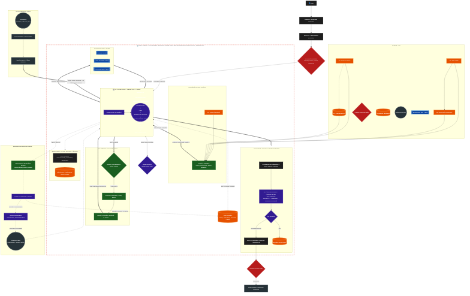
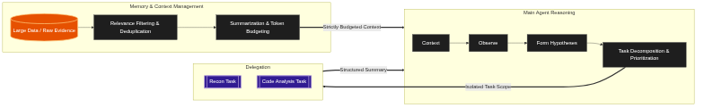
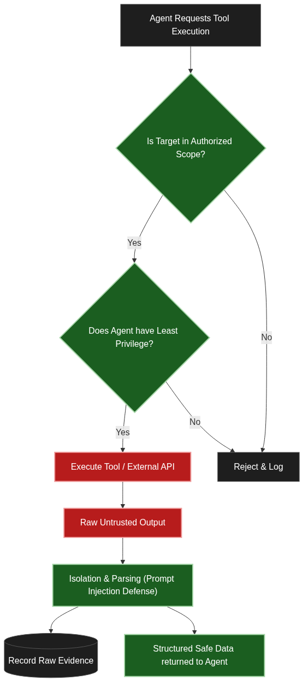
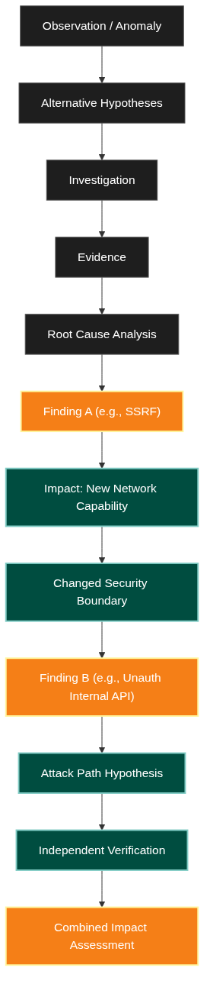

# Security Agent Architecture

Welcome to the Security Agent Architecture repository! This project contains the design, workflows, and reasoning loops for an advanced, autonomous Security Research and Bug Hunting Agent in Open Code. 

## Overview

The architecture is designed to handle complex security workflows, combining an orchestrator agent with specialized sub-agents (e.g., Recon Agent, Web Security Agent, Vuln Research Agent). It features isolated execution environments, persistent memory, and a comprehensive learning and evaluation loop.

## Architecture Diagrams

1. **Master System Architecture**
   - Concept: The overarching design of the agent, including user interaction, security boundaries, model routing, sub-agents, memory systems, and tool gateways.
   - [Mermaid File](1_master_system_architecture.mmd)
   - 

2. **Core Reasoning Loop**
   - Concept: The observation, hypothesis, action, and learning loop at the heart of the orchestrator.
   - [Mermaid File](2_core_reasoning_loop.mmd)
   - 

3. **Tool Gateway & Safety**
   - Concept: Ensuring all agent actions go through policy checks, safe execution boundaries, and isolated parsing to prevent untrusted content from breaking the system.
   - [Mermaid File](3_tool_gateway_safety.mmd)
   - 

4. **Chain Discovery Pipeline**
   - Concept: Combining findings (e.g., Finding A + Finding B) to evaluate impact, check for known vulnerabilities, and push novel findings through deep verification.
   - [Mermaid File](4_chain_discovery_pipeline.mmd)
   - 

## Additional Documentation
- [Token Optimization Skill](token-optimization-SKILL.md) - Guidelines and methods for keeping the agent's context clean and budget-friendly.
