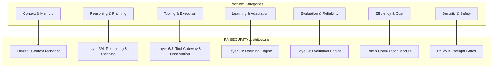

# Problem ↔ Architecture Matrix

| Problem | Category | Architectural Component | Mitigation | Status |
| :--- | :--- | :--- | :--- | :--- |
| **Context Window Saturation** | Context & Memory | Observation Layer & Context Manager | Filter tool outputs before hitting context; manage token budgets. | 🟢 CURRENT |
| **Context Contamination** | Context & Memory | Context Manager | Scope-based memory partitioning. | 🟡 EXPERIMENTAL |
| **Memory Staleness** | Context & Memory | Core Reasoning Loop | Time-aware hypothesis reassessment. | 🔵 PLANNED |
| **Incorrect Memory Retrieval** | Context & Memory | Skill Registry | Hybrid search and structured retrieval mechanisms. | 🟣 RESEARCH |
| **Experience Confusion** | Context & Memory | Learning Layer | Strict separation of raw transcripts from validated semantic rules. | 🟣 RESEARCH |
| **Reasoning Restart** | Reasoning & Planning | Curriculum Engine | Extraction of reusable methodology from isolated tasks. | 🟣 RESEARCH |
| **Hypothesis Fixation** | Reasoning & Planning | Evaluation Layer | Independent forcing of alternative hypothesis generation. | 🟡 EXPERIMENTAL |
| **Poor Task Decomposition** | Reasoning & Planning | Orchestrator & Planner | Hierarchical delegation to specialized Sub-Agents. | 🟢 CURRENT |
| **Premature Conclusions** | Reasoning & Planning | Chain Discovery Pipeline | Deep verification gates before reporting. | 🟡 EXPERIMENTAL |
| **Tool Chaos** | Tool Use & Execution | Planning Layer | Just-in-time tool selection based on active hypotheses. | 🟢 CURRENT |
| **Output Misinterpretation** | Tool Use & Execution | Isolate & Parse Gateway | Deterministic parsing of messy terminal outputs to JSON. | 🟢 CURRENT |
| **Missing Boundaries** | Tool Use & Execution | Tool Gateway Policy Check | Strict separation between planning capacity and execution authority. | 🟢 CURRENT |
| **No Real Learning** | Learning & Adaptation | Learning Layer | Pipeline mapping Experience → Analysis → Extraction. | 🟣 RESEARCH |
| **CTF Memorization** | Learning & Adaptation | Curriculum Engine | Focus on generalized vulnerability mechanics rather than payloads. | 🟣 RESEARCH |
| **False Success** | Evaluation & Reliability | Evaluation Layer | State-transition checking independent of the main LLM. | 🔵 PLANNED |
| **Unmeasured Improvement** | Evaluation & Reliability | Training Engine | Regression testing against holdout CTF sets. | 🟣 RESEARCH |
| **Excessive Tool Calls** | Efficiency & Cost | Token Optimization Module | Enforcement of parallel execution and minimal looping. | 🟢 CURRENT |
| **Repeated Context** | Efficiency & Cost | Context Manager | State compression rather than full history injection. | 🟡 EXPERIMENTAL |
| **Untrusted Output** | Security & Safety | Isolate & Parse Gateway | Sanitizing inputs to prevent Indirect Prompt Injection. | 🟢 CURRENT |
| **Scope Confusion** | Security & Safety | Preflight Gate | Hardcoded domain blocking and scope-limit enforcement. | 🟢 CURRENT |

## Architecture Problem Map

